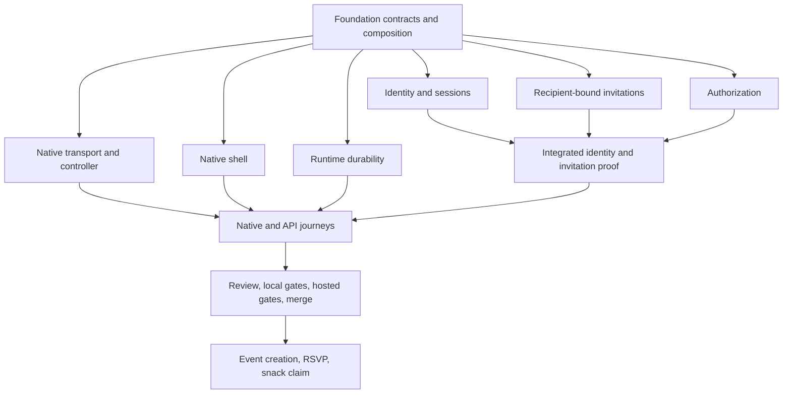

# 0010 — Beta application contracts and runtime

- Status: Accepted for implementation; remote staging and identity evidence pending
- Date: 2026-09-14
- Baseline: `e0842fd` (merged PRs #1–#3)

## Decision

Keep Bun, Lesto, native SwiftUI, and independent teams. Person, Account, Household,
Participant and memberships remain distinct. Children need no account. League
operations remain R4 and branded apps remain R5.

`packages/domain/src/policies.ts` owns the authorization decision. Runtime adapters
load current records and delegate to it. Owner-only delegation, coach operations,
ordinary membership and additive guardian rights remain separate. A selected team,
season or cached capability never grants access. Operations validate tenancy and
authorize even when invoked without HTTP.

`composition.ts` is a pure application factory. Callers inject SQL, typed database,
sessions, clock and provider adapters. Lesto request variables carry services to
page loaders; there is no process-global service registry. `lesto.app.ts` exports
a boot factory, supported by the installed CLI, so imports do not open databases.

For R0 use one Bun instance and SQLite on a persistent volume behind HTTPS. This
scopes the earlier ADR 0003 Cloudflare demonstration: the existing static Worker
is not the beta API host. D1 cannot support the installed application's interactive
transactions. Postgres/Hyperdrive requires a separate migration and concurrency
verification slice. Local and staging use the same application migrations.

Use Lesto store-backed Sessions for expiry/revocation and hashed session tokens.
Apple JWT verification checks fixed issuer/audience, signature, expiry and a
single-use persisted challenge. Link only stable provider subjects; never merge
accounts by name or email. Adult consent is explicit and is not age verification.
Verified email onboarding and live Apple evidence remain incomplete until exercised
with real provider/account configuration.

Invitation recipients are either provider-verified email addresses or an exact
active adult person explicitly confirmed by the owner. Legacy unbound links fail
closed. Accepting ordinary team membership does not create child authority; a child
grant requires an explicitly targeted recipient-bound invitation. Placeholder
guardian replacement must name an owner-confirmed relationship ID, never a name.
Persist delivery intent before delivery; use Lesto queue retry primitives. A
recorded local delivery is never evidence that an email was sent.

## Frozen contracts

- TypeScript: `packages/domain/src/api-contracts.ts` and server
  `application-contracts.ts`.
- Swift: `TransportModels.swift` and `ApplicationContracts.swift`.
- Canonical payloads: `contracts/fixtures/*.json`; validate real server responses
  and decode these same resource files in Swift tests.
- `POST /api/auth/apple/challenge` → `{challengeId, nonce}`. Native sends SHA-256
  of the returned UTF-8 nonce, encoded as lowercase hexadecimal, to Apple's
  request; the verifier checks that exact nonce claim.
- `POST /api/auth/apple/sign-in` accepts `{challengeId, identityToken,
displayName?, adultConsent:true}` and returns the existing account/person shape.
- `GET /api/session` returns that identity or 401. `POST /api/session/logout`
  revokes the server session and returns `{signedOut:true}`.
- Team directory retains `access` and adds `{read, manage, delegate}` capability
  hints. Absent/unknown capabilities fail closed in clients.
- Native controller owns restoration, cancellation, generation checks and
  identity-bound team/season selection. Release never calls development sign-in
  or falls back to a successful preview. Missing configuration is visible.

## Dependency map

Typed authentication stubs exist only to cut independent branches. They deny
access and are not registered as completed release functionality. Convergence
must remove them and run real implementations. Account-dependent requirements
remain incomplete regardless of mocked-provider tests or successful local gates.
