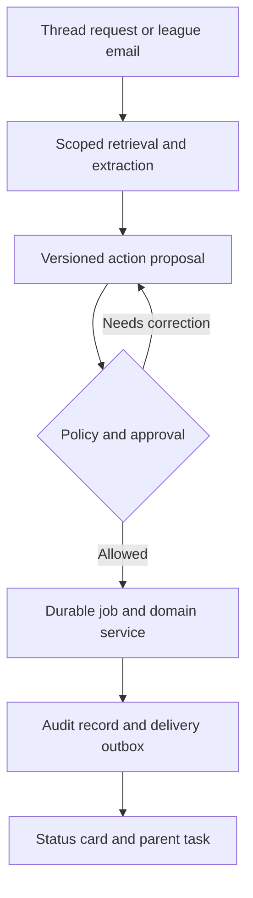

# Snack Duty: coach–parent–player release plan

Prepared September 11, 2026. Repository audited: `rdimascio/snackduty`, commit `38dab8b227e8da51b123f45382b82ebb1dd6aeec`.

Status: implementation proposal grounded in source inspection and the checks below. This is not a release certification. No production deployment, Apple account inspection, signed archive, or TestFlight upload occurred in this audit. Existing source still uses **Snackday**; this document uses the owner's **Snack Duty** name without changing bundle identifiers or source names.

Restoration update, September 14: local GitHub CLI authentication works, the initial fetch found no main changes newer than the audited base, and the restored foundation has since merged through PR #1 with local and hosted macOS gates passing, including simulator tests/build and live native/API acceptance. Historical audit results below remain dated evidence. See [implementation-status.md](./implementation-status.md) for current co-coach progress and publishing status; production and TestFlight release requirements remain open.

## Decision

**Build for one coach running one team, with the same adult also acting as a parent.** Serve coaches, co-coaches, players through their parents, and families first. League administration is an expansion; separate league-branded App Store releases are the final distribution phase.

The initial promise is: **“Run your team, help your players improve, and keep parents in the loop.”** A coach sets up a roster, invites co-coaches and parents, publishes games/practices, assigns duties and shares a practice plan. A parent RSVPs, knows what to bring, asks questions in a thread and confirms practice at home. One person can do both without separate accounts.

Keep native SwiftUI, the TypeScript domain and existing roster/calendar services. Ship one Snack Duty app first. Support independent team tenancy and multiple team memberships now, without requiring a league entity or branded binary to onboard a team.

**Ordering:** R0 release foundation → R1 your team's coordination beta → R2 coach/player development and team assistant → R3 connected coach and forms → R4 league operations → R5 optional league-branded apps. Equipment commerce is a separate optional experiment, not a milestone dependency.

This revision supersedes the earlier email-led sequence. Coach-created practice guidance and parent-approved sessions come before league administration. Parent-managed child profiles are sufficient; independent child accounts are not required. Gmail and forms assist the coach later.

The source audit below describes the original commit, not the status of subsequent local implementation. Release claims still require production/native evidence.

## 1. What exists and what blocks release

The source contains a meaningful local foundation. It is not a functioning production app awaiting only signing.

| Area                     | Evidence at audited commit                                                                                                                                                                                                                                                                                                                                                                                                                                       | Release implication                                                                                                           |
| ------------------------ | ---------------------------------------------------------------------------------------------------------------------------------------------------------------------------------------------------------------------------------------------------------------------------------------------------------------------------------------------------------------------------------------------------------------------------------------------------------------- | ----------------------------------------------------------------------------------------------------------------------------- |
| Native client            | [`AppRootView.swift`](https://github.com/rdimascio/snackduty/blob/38dab8b227e8da51b123f45382b82ebb1dd6aeec/apps/ios/Snackday/AppRootView.swift) has a home view, three placeholder tabs, noninteractive action tiles, and hard-coded snack/forms/announcement content                                                                                                                                                                                            | Complete usable screens and remove misleading status before inviting families                                                 |
| Native launch/auth       | [`AppLaunchView.swift`](https://github.com/rdimascio/snackduty/blob/38dab8b227e8da51b123f45382b82ebb1dd6aeec/apps/ios/Snackday/AppLaunchView.swift) uses process environment configuration or preview data; [`SnackdayAPIClient.swift`](https://github.com/rdimascio/snackduty/blob/38dab8b227e8da51b123f45382b82ebb1dd6aeec/apps/ios/SnackdayDomain/SnackdayAPIClient.swift) signs into `/api/dev/sign-in`, selects the first team/season, and loads its roster | Production configuration, sign-in, session lifecycle, team switching and mutation APIs are missing                            |
| Identity                 | [`identity-providers.ts`](https://github.com/rdimascio/snackduty/blob/38dab8b227e8da51b123f45382b82ebb1dd6aeec/apps/web/app/lib/server/identity-providers.ts) implements only fixed development personas                                                                                                                                                                                                                                                         | Never enable development identity to make a remote demo work                                                                  |
| Backend                  | [`lesto.app.ts`](https://github.com/rdimascio/snackduty/blob/38dab8b227e8da51b123f45382b82ebb1dd6aeec/apps/web/lesto.app.ts) composes SQLite-backed teams, roster, invitations, events, attendance and feeds                                                                                                                                                                                                                                                     | Reuse these services and existing tests                                                                                       |
| Deployment               | [`worker.ts`](https://github.com/rdimascio/snackduty/blob/38dab8b227e8da51b123f45382b82ebb1dd6aeec/apps/web/worker.ts) serves four pages; [`wrangler.jsonc`](https://github.com/rdimascio/snackduty/blob/38dab8b227e8da51b123f45382b82ebb1dd6aeec/apps/web/wrangler.jsonc) has only an asset binding                                                                                                                                                             | A deployed marketing page would not provide the product API or database                                                       |
| Roster imports           | [`roster-import.ts`](https://github.com/rdimascio/snackduty/blob/38dab8b227e8da51b123f45382b82ebb1dd6aeec/apps/web/app/lib/server/roster-import.ts) has CSV parsing, preview, duplicate handling and transactional commit                                                                                                                                                                                                                                        | Use this as the destination for normalized agent import drafts                                                                |
| Roles/privacy            | [`team-reads.ts`](https://github.com/rdimascio/snackduty/blob/38dab8b227e8da51b123f45382b82ebb1dd6aeec/apps/web/app/lib/server/team-reads.ts) returns a common roster projection to adult readers, including birth dates and guardian relationships                                                                                                                                                                                                              | Introduce field-level manager, own-child and ordinary-member responses before using real rosters                              |
| Authorization            | [`policies.ts`](https://github.com/rdimascio/snackduty/blob/38dab8b227e8da51b123f45382b82ebb1dd6aeec/packages/domain/src/policies.ts) defines richer rules; runtime [`teams.ts`](https://github.com/rdimascio/snackduty/blob/38dab8b227e8da51b123f45382b82ebb1dd6aeec/apps/web/app/lib/server/teams.ts) uses creator/owner and adult membership rules                                                                                                            | Unify enforcement before adding bot and league permissions                                                                    |
| Invitations              | [`invitations.ts`](https://github.com/rdimascio/snackduty/blob/38dab8b227e8da51b123f45382b82ebb1dd6aeec/apps/web/app/lib/server/invitations.ts) supports token expiry, rotation, acceptance and revocation; [`invite-delivery.ts`](https://github.com/rdimascio/snackduty/blob/38dab8b227e8da51b123f45382b82ebb1dd6aeec/apps/web/app/lib/server/invite-delivery.ts) only records delivery in memory                                                              | Add real delivery and persistent retries; participant guardian grants need verified recipient binding or manager confirmation |
| Calendar                 | Events, recurrence, DST, cancellations, attendance, revocable feeds and ICS exports exist                                                                                                                                                                                                                                                                                                                                                                        | Complete native UI; distinguish subscription from two-way sync                                                                |
| Feed credentials         | [`calendar-feeds.ts`](https://github.com/rdimascio/snackduty/blob/38dab8b227e8da51b123f45382b82ebb1dd6aeec/apps/web/app/lib/server/calendar-feeds.ts) explicitly documents raw token paths in actual API-tier logs; redaction is installed only in the DB-less Worker                                                                                                                                                                                            | Fix actual API logs and traces, or withhold subscription endpoints until fixed                                                |
| Signing/release          | [`project.pbxproj`](https://github.com/rdimascio/snackduty/blob/38dab8b227e8da51b123f45382b82ebb1dd6aeec/apps/ios/Snackday.xcodeproj/project.pbxproj) has `com.snackday.app`, version `0.1.0`, build `1`, automatic signing but no checked-in team; app icon catalog has no image filename                                                                                                                                                                       | Verify actual Apple registration; add icon, release configuration, capabilities and signed archive workflow                   |
| CI                       | Only a platform-manifest workflow exists; iOS scripts build/test simulators with signing disabled                                                                                                                                                                                                                                                                                                                                                                | Add product checks and a real macOS build lane                                                                                |
| Missing product services | No implementations found for snack duties, channels/messages/threads, APNs, persistent jobs, Gmail, PDF storage/signing, league hierarchy or practice rewards                                                                                                                                                                                                                                                                                                    | These are planned features, not existing capabilities to switch on                                                            |

Household, generalized role and audit-event domain schemas are useful but do not imply persisted, enforced production features. Existing backlog statuses are stale relative to the source. The new backlog accompanies this audit without rewriting historical records.

### Verification performed

- Frozen dependency install initially failed building `better-sqlite3` under this Linux/Node 24 environment: no matching prebuilt binary and a header extraction ownership error. This is an environment limitation, not proof that macOS installation fails.
- Frozen install with lifecycle scripts disabled succeeded. Tests executed through Bun 1.3.5 and its SQLite runtime; this does not validate the Node native SQLite binary.
- Existing formatting check passed. Lint exited successfully with existing warnings. All workspace typecheck commands passed; the iOS command is a project-structure check, not Swift compilation.
- Web: **214 tests passed**. Domain: **10 tests passed**. Platform manifest: **39 tests passed**.
- Web production build passed separately.
- Full `gate` exited unsuccessfully at iOS tests because Xcode is unavailable. It did not reach full build/acceptance. No Swift compilation, simulator UI test, live native acceptance, signed device build, APNs delivery or production smoke test is claimed.
- `docs/local-development.md` says acceptance is outside `gate`, while root `package.json` includes it. Correct the documentation and make Linux/macOS gate responsibilities explicit without silently dropping native verification.

## 2. Current market and positioning

Research checked September 11, 2026. These are primary-source vendor claims, not hands-on quality comparisons. There is already substantial competition for the broader ecosystem; “all in one” and “AI assistant” alone are not defensible distinctions.

| Product                                                         | Current advertised coverage                                                                                                                                           | What that means for us                                                             |
| --------------------------------------------------------------- | --------------------------------------------------------------------------------------------------------------------------------------------------------------------- | ---------------------------------------------------------------------------------- |
| [TeamSnap](https://www.teamsnap.com/teams)                      | Messaging, schedules, assignments, calendar sync, payments, drills/practice plans                                                                                     | Basic team coordination and practice content are expected                          |
| [TeamSnap for Business](https://info.teamsnap.com/registration) | Registration, roster assignment, digital waivers, payments and organization administration                                                                            | League workflows already have established vendors                                  |
| [SportsEngine HQ](https://www.sportsengine.com/hq/)             | Registration, scheduling, websites, volunteers and eligibility; [registration](https://www.sportsengine.com/hq/features/registration/) collects documents and waivers | Compete on onboarding and completion rather than matching every module immediately |
| [GameChanger](https://gc.com/app-features/team-management)      | Roster, scheduling, messaging, calendar integration; [team announcements](https://www.gc.com/post/team-announcements-gamechanger) launched August 20, 2026            | Coexist with scoring/video first; do not assume teams want to replace those tools  |
| [TeamLinkt](https://teamlinkt.com/)                             | Emi assistant advertises building forms, schedules and communications                                                                                                 | A generic admin chatbot is already offered                                         |
| [LeagueHero](https://www.leagueheroapp.com/ai)                  | AI field-time search and cited league-rule answers                                                                                                                    | AI scheduling and league knowledge are not empty categories                        |
| [Playtime](https://playtime.net/team-management)                | Pasted roster/schedule parsing and easy parent join links                                                                                                             | Import convenience alone will not be enough                                        |

Our first testable distinction is **a coach's whole weekly loop in one place**: prepare practice, coordinate parents, cover duties, track participation and recognize effort at home. A parent opens directly to their child's next action. The assistant works inside that loop. Reliable completion across email/forms is a later enhancement.

Start with the owner's own recreational baseball/softball team, the coaches they work with and that team's parents. No league administrator or contract is required. Validate weekly coordination and at-home practice, then expand to a few independent teams. Use neutral CSV/ICS/PDF inputs and permitted integrations; no dependency on scraping another sports app.

Keep family participation free during the pilot. Test a team/league-paid administrative product later; do not fund the child experience through targeted advertising. Track cost per active team: hosting/storage, delivery, inference/OCR, signature provider envelopes and support. Gmail assessment and legal/provider setup are separate project costs requiring quotes; no fixed cost is asserted here.

## 3. Product experience

### Four simple destinations

| Destination | Parent experience                                                                          | Coach/coordinator experience                                            |
| ----------- | ------------------------------------------------------------------------------------------ | ----------------------------------------------------------------------- |
| Today       | Next event across children, own snack duty, forms needing action, unread important notices | Team readiness, uncovered duties, pending imports and approvals         |
| Schedule    | RSVP, directions, duties and calendar subscription                                         | Create/edit/cancel events, manage attendance and coverage               |
| Team        | Roster appropriate to permissions, family links and approved resources                     | Roster import, invitations, roles and setup checklist                   |
| Messages    | Team channels, event threads and actionable cards                                          | Announcements, staff channel, thread assistant and communication drafts |

Account/settings includes linked services, notification preferences, privacy, export/deletion and team switching. Forms appear as tasks with their own secure detail screen, not as medical PDFs buried in chat.

### Channels and threads

Begin with Team Announcements, Team Chat and Staff. Announcements restrict posting to authorized adults; replies are threads. An event or form request can have a linked discussion. Avoid forcing every team to configure a Slack-style workspace.

Messages have human, system or agent authors. Structured cards reference real records: event, duty, import proposal, form request or practice request. The message is a view of the action, not the source of truth. Editing a message cannot silently change a game time or a signed form.

An authorized adult can add the assistant to a thread. The UI shows its purpose and allowed tools. Start with one team assistant with configurable name, tone and league-approved knowledge. Arbitrary third-party bots and uploaded executable plugins can wait.

Example: a coordinator forwards a roster. The assistant responds privately: “I found 12 players, 18 guardian entries and two possible duplicates. Review roster.” The admin resolves the duplicates and approves a versioned change set. Invitations are a separately visible action showing the recipients. Parents see an invitation and their own tasks; they never see the admin's mailbox.

### Polish that earns trust

Use the existing semantic SwiftUI design tokens, then review contrast, Dark Mode, Dynamic Type and VoiceOver. Prefer a short confirmation animation or light haptic when an action actually succeeds. Honor Reduce Motion. Avoid animated success while a job is pending. Persist drafts, show retry states, preserve scroll position, and make notification links open the relevant record. A failed import should keep the original and explain which fields need correction.

## 4. Roles, tenancy and child experience

Preserve `Person`, `Account`, `Household`, `Participant` and guardian relationships as separate concepts. An adult may be a coach on one team, a parent on another, and a board member in a league. A single global role field will not work.

**Now:** Team → Season → memberships and participants. Team is the initial isolation boundary. Every scoped query/mutation resolves to an authorized team/season. Account/person identity can span teams; membership and guardian access are checked separately. Test an unrelated second tenant from day one even while the first pilot uses only the owner's team.

Coach and parent are additive relationships on one identity. A coach can manage their team and act for their own child there or on another team. The beta needs explicit co-coach capabilities and invitations, not a global role toggle that replaces parent access.

**Later:** Organization → League season → Division → Team enrollment. Adopt existing independent teams only through an authorized flow preserving IDs, history and guardian relationships. Neither a league role nor a branded app silently grants ownership of a team.

| Role/scope                   | Intended powers                                                   | Sensitive boundary                                                                    |
| ---------------------------- | ----------------------------------------------------------------- | ------------------------------------------------------------------------------------- |
| Organization owner/admin     | Seasons, teams, delegated staff, settings                         | Administrative access does not automatically confer medical/screening access          |
| Board/scheduler              | Assigned governance tasks, venues, game/practice schedules        | Capability-specific grants; no blanket roster/document access                         |
| Registrar/compliance officer | Registration, eligibility, approved forms, screening status       | Restricted records and access audit                                                   |
| Coach/team manager           | Team roster, events, announcements and authorized readiness views | Medical access separately granted and justified                                       |
| Volunteer/snack coordinator  | Assigned duties and coverage                                      | No unrelated child records                                                            |
| Parent/guardian              | Own linked children, RSVP, signatures, duties and team discussion | Guardianship and signing authority must be explicitly established                     |
| Player                       | Later: parent-managed practice requests and progress              | No independent child account or direct adult messaging required in the initial design |
| Agent                        | Explicit delegated tools in a specific scope                      | Never gains authority just by joining a channel                                       |

Authorization must apply to API reads, writes, search/retrieval, downloads, job execution and notifications. Use one capability policy service with scoped memberships and guardian relationships, then field-level projections. Verify tenant/season/participant relationships in storage queries. A thread's audience must never expand the permissions on a linked form or private source.

For the first beta, adults operate the app and manage child profiles. This reduces scope but is not a blanket legal exemption. FTC guidance distinguishes data supplied by adults from data collected online from children; a child-facing practice/rewards experience changes that analysis. Before enabling children to use it, review current COPPA obligations, verifiable parental consent, retention, deletion and third-party processing against the [FTC guidance](https://www.ftc.gov/business-guidance/resources/complying-coppa-frequently-asked-questions) and [amended rule announcement](https://www.ftc.gov/news-events/news/press-releases/2025/01/ftc-finalizes-changes-childrens-privacy-rule-limiting-companies-ability-monetize-kids-data).

## 5. Agent architecture

Build a modular backend with durable jobs, not a collection of autonomous chatbots. Keep existing domain services as the only mutation path. SwiftUI and web clients call the same authorized API; the agent calls a typed tool facade over those services.

Suggested persisted records: `integration_connection`, `source_item`, `source_attachment`, `ingestion_cursor`, `agent_run`, `action_proposal`, `approval`, `job`, `outbox_delivery`, `audit_event`. Conversations use `channel`, `channel_membership`, `thread`, `message` and `message_action_reference`.

Effective authority is the intersection of the installation's scope, the requesting adult's current permissions, the target scope and the action policy. A Gmail credential authorizes mailbox access for its owner; it is not permission to publish the mailbox into a team thread.

Execution requirements:

1. Treat emails, PDFs, websites and message attachments as untrusted content. Extract bounded structured data; never treat an instruction inside an attachment as a tool instruction. Scan attachments, enforce size/type/page limits and constrain URL retrieval to avoid internal-network fetches.
2. Create a proposal containing source references, extracted values, ambiguity flags, proposed operations, affected records, target revision and recipient list where applicable. A confidence score is not a substitute for factual validation.
3. An approval binds to the exact proposal revision and intended recipients. Changes after review invalidate the approval. Recheck permissions and record versions when executing.
4. Persist business changes and their outbox records transactionally. Give jobs idempotency keys, retries, deadlines, cancellation and dead-letter visibility. Remote delivery is at least once; provider deduplication/reconciliation handles ambiguous outcomes. Do not promise exactly-once email.
5. Record typed outcomes and sanitized audit events. Report completed, failed or pending accurately. Bound model calls, attachment processing and per-team spend. Credentials stay outside prompts and clients.

Initial tools: `roster.preview_import`, `roster.commit_import`, `invites.preview_recipients`, `invites.send`, `events.propose_change`, `duties.propose_rotation`, `reminders.preview`, `reminders.schedule`, `forms.request_completion`, `team.read_readiness`. Native buttons invoke the same operations.

| Action                                                                   | Initial autonomy policy                                        |
| ------------------------------------------------------------------------ | -------------------------------------------------------------- |
| Summarize authorized schedule or explain an approved rule                | Allowed within scope, with sources where factual               |
| Extract roster, suggest rotation or draft an announcement                | May create a private draft                                     |
| Import roster, alter event, send invitations/announcements               | Adult reviews the concrete change and affected recipients      |
| Routine reminder for an already approved duty/event                      | Automatic within configured schedule, audience and preferences |
| Sign a waiver, grant guardianship, decide eligibility or clear screening | Reserved for the authorized human/provider workflow            |

Evaluation set: redacted or synthetic roster spreadsheets, scanned PDFs, forwarded email chains, duplicate messages, conflicting schedules, ambiguous names, prompt-injection text and revoked-role jobs. Measure extraction field accuracy, correction rate, unintended changes and successful completion. The release must fail safely on uncertainty and never invent a roster member, signature or game time.

## 6. Gmail and calendar integrations

### Gmail

`gmail.readonly` is a restricted scope. Application-side filtering by sender or label does not narrow the underlying grant to only league emails. Server-side storage/transmission of restricted data introduces Google's security-assessment requirements; verification may take weeks and assessment cost requires a provider quote. OAuth Testing generally limits the project to 100 listed users and Gmail authorizations/refresh tokens expire after seven days, so that is not a dependable long-running production integration. [Gmail scopes](https://developers.google.com/workspace/gmail/api/auth/scopes), [restricted-scope verification](https://developers.google.com/identity/protocols/oauth2/production-readiness/restricted-scope-verification), [testing audience](https://support.google.com/cloud/answer/15549945?hl=en).

Start verification preparation in parallel: owned domain, privacy/support pages, exact scope justification, consent video, data inventory and assessor quote. Initial beta uses manual CSV import. First agent proof accepts a deliberately forwarded league message or uploaded PDF; it does not require a personal mailbox connection. Forwarded email still needs sender validation, attachment controls, privacy protection and admin review.

For Gmail rollout, use incremental authorization separate from app login, explicit sender/label selection, bounded lookback, encrypted refresh tokens, disconnect/revoke/delete controls and a visible last-sync state. Persist message IDs, attachment hashes and history cursors; reconcile duplicates and missed updates. Gmail watches use Pub/Sub and must be renewed at least every seven days; Google recommends daily renewal. [Push guide](https://developers.google.com/workspace/gmail/api/guides/push).

Use only processing arrangements consistent with Google's Limited Use rules; Workspace content must not become general model-training data. Do not include medical form answers in general thread context. [Workspace data policy](https://developers.google.com/workspace/workspace-api-user-data-developer-policy).

### Calendar

First expose existing revocable team ICS subscriptions after fixing credential logging. Label them “Subscribe to team calendar.” They are one-way and refresh timing belongs to the receiving calendar app. Urgent cancellations and snack reminders must come from Snack Duty's own notification service. Feed contents should be an explicit safe projection; current free-text notes could still contain a child's name even though no roster data is joined.

Next offer a dedicated Google calendar using the narrower `calendar.app.created` scope where appropriate. Native EventKit write-only event creation cannot read a user's events and does not provide general two-way synchronization. [Google scopes](https://developers.google.com/workspace/calendar/api/auth), [EventKit](https://developer.apple.com/documentation/eventkit/accessing-calendar-using-eventkit-and-eventkitui).

True two-way sync is a later product: persist provider IDs and revisions, define who owns event time/location, preserve recurrence and cancellations, detect conflicts, recover invalid sync tokens with a full provider-cache rebuild, and renew notification channels. A coach's authoritative game should not move because a parent edited their personal copy. [Google incremental sync](https://developers.google.com/workspace/calendar/api/guides/sync), [calendar notifications](https://developers.google.com/workspace/calendar/api/guides/push).

## 7. Forms and the coach's digital packet

Treat “DocuSign-like” as an experience requirement, not a claim that drawing a signature proves every legal obligation. Preserve the exact league-approved document and version. First support a small set of verified templates; arbitrary scanned forms need mapping and review.

Workflow: admin uploads blank form → system suggests fields → admin confirms template and permitted signers → parent opens own request → prefilled known values are reviewed → parent enters missing answers and explicitly signs → final PDF and evidence are sealed → parent receives a copy → authorized staff sees completion and, separately, any permitted document detail.

Persist immutable template versions, envelope/participant/guardian linkage, consent and intent text, signer identity and authority, timestamps, document hashes, evidence and final artifacts. Corrections require a new version/envelope; the agent never fabricates a signature. Evaluate an embedded e-sign provider first for signature/evidence handling; selection depends on mobile UX, webhook reliability, cost and league acceptance. Simple acknowledgements may be a separate native workflow with appropriately limited claims.

Electronic records/signatures have general legal recognition, but that does not require every recipient to accept every electronic workflow or remove substantive requirements. Confirm the actual league, insurer and governing-body acceptance before promising to eliminate paper. [15 U.S.C. §7001](https://www.govinfo.gov/content/pkg/USCODE-2023-title15/html/USCODE-2023-title15-chap96-subchapI-sec7001.htm). The [Little League medical release](https://www.littleleague.org/downloads/medical-release-form/) explicitly says managers should carry it; it contains medical and insurance information. The product must support authorized offline access and an exportable packet, with a printable fallback while acceptance is confirmed.

Separate document completion status from medical answers. Use private encrypted object storage, short-lived authorized downloads, access auditing and explicit retention rules. Offline copies need device protection, a freshness timestamp and bounded cache lifetime; immediate revocation cannot be guaranteed on a disconnected device. Do not claim HIPAA compliance by default or put medical details in push previews.

## 8. Release sequence and execution backlog

The companion `launch-backlog.json` contains dependency-linked tasks and completion criteria. Sol implementation agents work in isolated branches; the orchestrator reviews diffs and tests. The user has authorized opening and merging passing PRs. GitHub permissions and required branch checks still apply.

| Milestone                                | Scope and exit criteria                                                                                                                                                      |
| ---------------------------------------- | ---------------------------------------------------------------------------------------------------------------------------------------------------------------------------- |
| R0: release foundation                   | Real auth, team privacy/co-coach capabilities, production API, release configuration and signed internal build using synthetic data                                          |
| R1: your team's TestFlight beta          | Coach creates team and invites co-coach/parents; roster, schedule/RSVP, snack duties, reminders and threaded communication work on physical devices                          |
| R2: coach/player loop and team assistant | Coach shares reviewed drills/practice plans; parent approves a session and confirms completion; coach sees a digest; private effort milestones and a scoped thread assistant |
| R3: connected coach and forms            | Forward/upload documents, review imports, complete approved forms and coach packet; verified Gmail and narrow calendar integrations                                          |
| R4: league operations                    | League/division/season administration, team adoption, approved resource libraries, registration, volunteers and external screening status                                    |
| R5: optional league-branded apps         | Shared code with per-league branding/build/distribution records, publisher ownership and Apple review strategy; no per-league source forks                                   |

Initial planning allowance: R0 roughly 1–2 weeks and R1 another 2–4 with focused backend/native work and prompt account setup. These are not Sol throughput predictions or delivery commitments. Re-estimate from completed slices and the first production/native proof. Apple review/provider verification have independent lead times. R2 comes ahead of league work: start with a small practice loop rather than a video marketplace.

### First implementation completed locally

- Roster privacy: narrowed JSON and rendered roster responses for ordinary parents, preserved manager and authorized own-child access, and added regression tests including one adult managing a team while parenting on another.
- Snack-duty service: added event-linked single-capacity slots, manager assignments, parent claim/release and conflict handling. Native UI, swaps, rotation and reminders remain separate work.
- Roadmap/tenancy: make coach-plus-parent identity and co-coaches explicit; bring practice participation forward and reserve branded distribution for last.

Sol implemented both slices; the orchestrator reviewed and combined them locally. The combined web suite passes 224 tests, workspace typechecks and web build pass, and lint exits successfully with warnings. These are local results, not production/native evidence. GitHub branch creation returns 403; no PR, remote merge or TestFlight upload has occurred. See `implementation-status.md` in the delivery package for commit and verification details. These slices do not satisfy missing auth, delivery or native release requirements.

### Next implementation order

1. Publish the reviewed roster/privacy and snack-duty API slices when GitHub write access is restored; add explicit co-coach permissions and unify runtime authorization.
2. Prove production runtime and real adult authentication, secure invitations and native session/team selection. Follow the required sibling Lesto infrastructure guides before infrastructure changes. Unrelated platform-governance projects do not block the team beta.
3. Add durable jobs/outbox/audit, real invitation/reminder delivery, native schedule/duty flows, channels/threads and settings/moderation. Mutations must handle retries and concurrent parents.
4. Complete the coach/co-coach/parent journey on two devices; archive the completed R1 commit and submit that exact build for external beta review.
5. Add coach-authored practice plans, parent-mediated sessions and private effort recognition. Introduce the team assistant through the same authorized services.
6. Introduce email/forms/calendar automation for the coach. League operations follow demonstrated use by multiple teams; branded App Store distribution is last.

### Pilot success criteria

Start with the owner's team and its coaches/parents. Success is a full recurring week: coach publishes details, co-coach contributes, parent RSVPs/knows duty, parent asks a question in the right thread, and coach sees coverage without chasing messages. A coach who is also a parent acts for their own child without another account.

Initial targets: parent joins in under two minutes; no cross-team/household private-data exposure; every event has a visible duty owner or vacancy; delivery failures are visible. R2 measures practice-plan use, parent-confirmed sessions, coach review time and repeat participation. R3 adds form completion and administrative time saved. Do not reward raw screen time.

Move to three to five independent teams after the first weekly loop works. Monitor crashes, onboarding drop-off, RSVP/duty coverage, delivery reliability, practice participation and support. League sales and branded-app counts are not early success metrics.

## 9. TestFlight release runbook

As of this audit, Apple requires App Store Connect uploads to be built with **Xcode 26 or later and the iOS 26 SDK or later**. The app can retain a lower supported deployment target such as iOS 18 after compatibility testing. The repository's “Xcode 16 or newer” guidance is insufficient for current uploads. [Apple requirements](https://developer.apple.com/news/upcoming-requirements/).

Before archiving:

- Verify active Developer Program membership, App Store Connect role, app record and registered bundle ID. `com.snackday.app` is a source value, not proof of registration. Confirm the intended public name without renaming identifiers blindly.
- Configure the correct team, Apple Distribution signing/provisioning and required capabilities (Sign in with Apple, APNs, associated domains as implemented). An App Store Connect API key alone is not a signing certificate.
- Use explicit debug/staging/release configuration. Release requires an HTTPS API origin and must never silently render preview success or use the development provider. Scheme environment variables are not a shipped configuration mechanism.
- Supply the app icon, version/build numbering and any required usage descriptions/privacy manifests based on actual API/SDK use. Add privacy/support pages, in-app deletion, age-rating responses and export-compliance answers as applicable.
- Provide an accessible review account or review mode with synthetic records and complete beta review instructions. Testers must not need a developer server or special Xcode environment.
- Test channel filtering, reporting/blocking and support handling. Apple requires these safeguards for user-generated content; account creation also entails in-app deletion. If using third-party login for the primary account, address the equivalent-login requirements. [App Review Guidelines](https://developer.apple.com/app-store/review/guidelines/).

Build/distribute:

1. Run backend/domain gates and actual Swift tests in a macOS lane. Test the live HTTPS API and two-account authorization separately from the synthetic local harness.
2. Build a Release archive for a generic iOS device on Xcode 26+ with signing enabled. The existing simulator scripts do not perform this step.
3. Validate/export using App Store Connect distribution, upload, and wait for processing. Retain the exact commit, archive, dSYMs, build number and test evidence.
4. Install through an internal TestFlight group on physical iPhones. Confirm first launch, sign-in/returning session, invite handling, multi-team switching, RSVP/duty mutation, chat, deep links and notifications. TestFlight uses the production APNs environment; inspect the signed [APS entitlement](https://developer.apple.com/documentation/bundleresources/entitlements/aps-environment) and verify delivery rather than relying on simulator success.
5. Create an external test group, supply beta metadata and submit the build for review. Friends and parents generally belong here; internal testers are eligible App Store Connect users. Apple permits up to 100 internal and 10,000 external testers, and builds expire after 90 days. [TestFlight](https://developer.apple.com/testflight/), [Apple beta workflow](https://developer.apple.com/tutorials/develop-in-swift/test-your-beta-app).
6. After approval, invite the agreed pilot group and monitor failures/support. A beta review approval is distinct from public App Store release.

Required human/account inputs at the appropriate implementation step: Apple team/app identifiers and authorized signing access through secure account/CI configuration, an owned API domain/hosting destination, verified mail sender, and the first league's blank forms/roster format. Do not paste private keys, Apple passwords or medical records into issues or this public repository.

## 10. Coach/player development before league administration

Coaches create or curate age-appropriate practice plans and drills without league approval being a prerequisite. Authorized co-coaches can contribute/review team resources. A future league can supply an approved library; existing independent-team resources retain their permissions.

Practice loop: coach publishes reviewed drills → player proposes a 20-minute session through a parent-managed profile → parent approves time → coach receives an acknowledgement/digest → parent confirms completion → player receives a small private milestone. Coaches should not need to approve every daily session. Reward effort, include rest/accessibility alternatives, avoid public rankings or shame for missed streaks, and use licensed videos. Review child-facing consent/privacy before direct child interaction even inside a parent's account.

League administration grows later from independent-team use: seasons, divisions, roster allocation, venue constraints, board capabilities, registration, volunteers and approved communications. Scheduling starts with deterministic constraints and human approval. Use external screening-provider status and restricted evidence; never automate a background-check verdict. [SportsEngine/JDP](https://www.sportsengine.com/hq/features/background-checks/) illustrates the existing provider category.

Equipment commerce is an optional adult purchase flow after demand is established, with transparent fulfillment/returns and no effect on a child's rewards or participation.

## 11. Multi-tenant core now; multiple App Store releases last

| Concept          | When                                                   | Boundary                                                                                                         |
| ---------------- | ------------------------------------------------------ | ---------------------------------------------------------------------------------------------------------------- |
| Team tenancy     | Now                                                    | Server-authorized team/season membership; one database can host many isolated teams                              |
| Brand profile    | Preserve configuration seam now; tenant branding later | Name, approved assets and semantic theme; never an authorization source                                          |
| App distribution | R5                                                     | Bundle ID, App Store record, publisher/team, capabilities, domains, release channel and permitted tenant catalog |

Initially ship one Snack Duty binary. Do not create per-league repositories, targets, signing jobs or fleet management now. Use the existing design-system boundary; no team/league name belongs in domain logic. Later branding should not require remodeling participants or copying accounts.

At R5 use shared source plus a validated build manifest for each distribution. The manifest selects presentation/build identifiers; server policy controls which teams an account can access. A client-supplied team/brand/app-variant ID never grants membership. Accounts may belong to teams spanning leagues/apps; design that experience without duplicating identities per binary.

Each branded release needs its own review metadata, signing/provisioning, APNs topic, universal-link associations, privacy disclosures and update/testing status. Associate device tokens with account plus app/bundle/environment. Treat Apple identity issuer/audience/developer-team boundaries explicitly; Apple subjects are not assumed universal across publishers, and unverified email cannot merge identities.

**Apple review is a feasibility gate.** Guidelines 4.2.6 and 4.3 constrain commercial templates and repetitive app variants. Evaluate direct submission by the league/content provider with substantive customization. Cosmetic reskins are not guaranteed acceptance. Keep the shared multi-tenant app as the supported fallback; validate a representative branded submission before selling a fleet. [Apple App Review Guidelines](https://developer.apple.com/app-store/review/guidelines/).

The user's Luxury Presence analogy defines the desired commercial model; this plan does not claim knowledge of that company's internal app architecture or publishing arrangements. White-label distribution is the final milestone.

The next engineering milestone is the coach/co-coach/parent journey for one independent team on two devices, with server-enforced tenancy. Practice support and the assistant follow; league operations and branded distribution do not block it.
